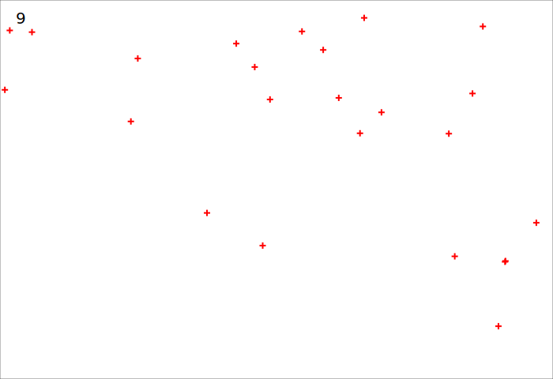
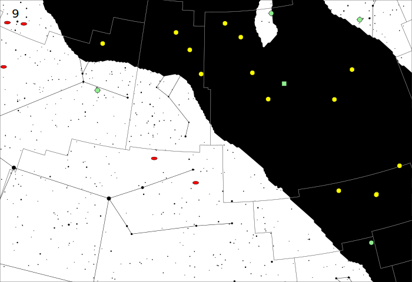

# star-maps

Genmap is a script written in Ruby to generate simple star maps in
scalable vector graphics (SVG) format.  My original intent was to
generate diagrams showing the location of the Herschel 400 objects on
the Sky Atlas 2000 maps, something like the following:



After discovering Diego Hernangomez's excellent repository of
[celestial data](https://dieghernan.github.io/celestial_data/data) in
geojson format, I expanded the tool to add more and more information
layers.  The end result looks like this:



## Installation

After you download the source files for star-maps, you should be able
to run genmaps from the top-level directory, assuming you have Ruby
installed.  Genmaps assumes Ruby is located in /usr/bin.  If not, you
may need to edit the top line of genmaps to point to your Ruby
installation.

## Command-line options

```
Usage: genmap [options]
    -w, --width SPEC                 Width of image, e.g. 6in
    -m, --map NUM                    Sky Atlas 2000 map number
    -u, --ul DDDD.D+DDDD             Upper-left map coordinate
    -l, --lr DDDD.D+DDDD             Lower-right map coordinate
    -S, --stars MAG                  Plot stars
    -G, --grid                       Plot grid
    -H, --herschel                   Plot Herschel 400 objects
    -p, --plus                       Print dsos as plus signs
    -M, --messier                    Plot Messier objects
    -D, --dso MAG                    Plot deep sky objects
    -C, --const                      Plot constellation lines
    -B, --border                     Plot constellation borders
    -W, --milkyway                   Plot milky way contours
```

Note, the map extent is either specified via the Sky Atlas 2000 map number or
by the upper-left and lower-right coordinates.

## Running genmap

Genmap downloads and caches data files in the `data` directory. The
output of genmap is an SVG file written to stdout.  You should
redirect this to a file. The easiest way to view a map is to point a
web browser to it using a local file URL, e.g.,
`file:///c:/<path>`. The SVG content can be included in a web page
using the `` tag or it can be viewed in an SVG editor, such as
Inkscape.  Inkscape can also be used to convert the SVG content to PDF
or various image formats.